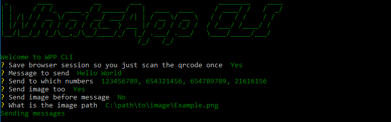

  
   
  <h1>WhatsApp CLI</h1>

## Contents

- [Requirements](#requirements)
- [Running the cli](#running)
- [Usage example](#usage-example)

## Requirements

* Python `3.5`
* Google Chrome version `76`

## Running

* python -m venv env
* cd env/Scripts
* ./activate
* cd ../../

* pip install requirements.txt

* python main.py

## Usage example

  
   

